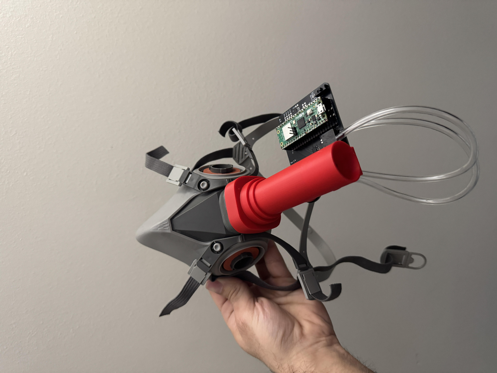
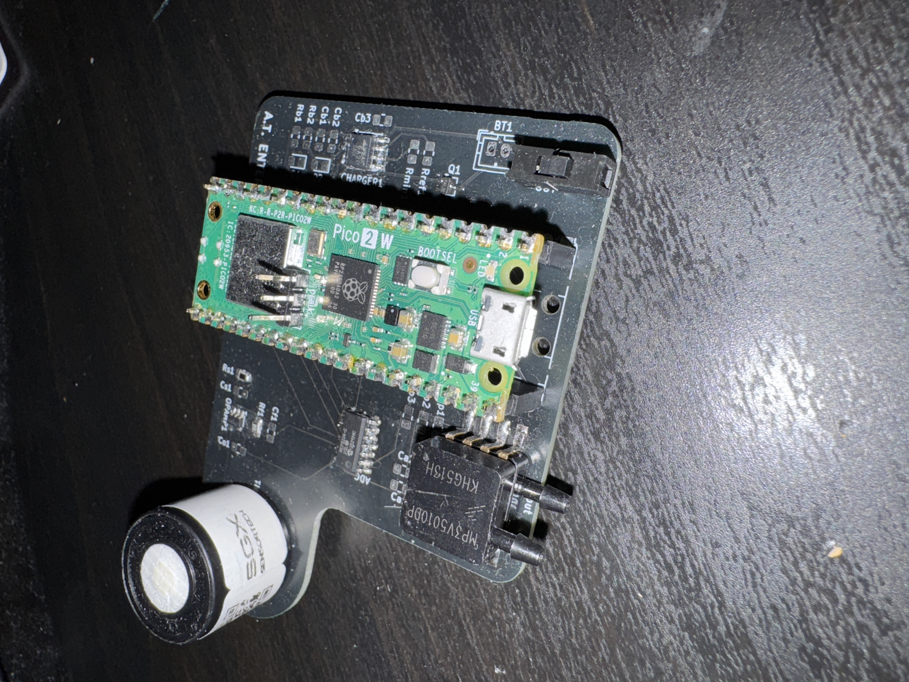
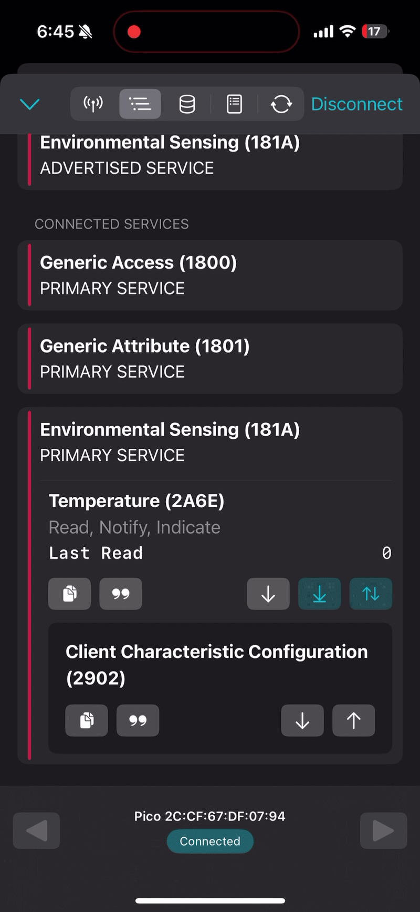
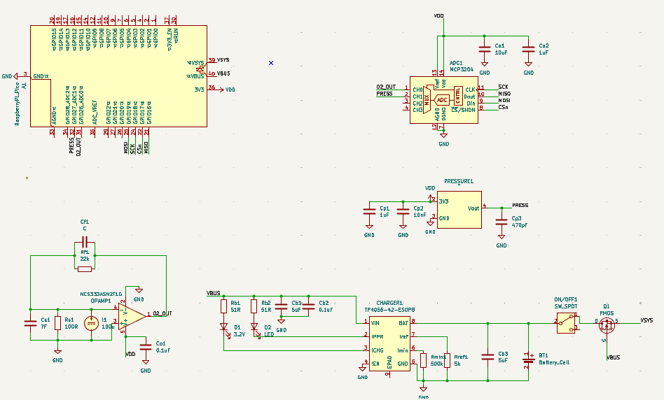
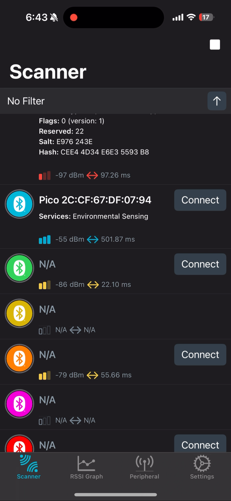

# VO2-Max-Respirator
Portable VO2 max respirator to measure biometric VO2. Reads airflow from respirator mask, sends output to phone via BLE. 

  
    

## Operation
VO2 Max respirator reads data from exhaled breath of user and sends output via BLE. Demo using NRF connect app:

  

(This is my resting VO2. My max is much, much, much higher than that)

This shows how the user can read the VO2 values calculated by the mask via BLE. Any bluetooth reader app can work, as well as certain fitness apps such as strava.

## Overview

This project implements a real-time embedded system for estimating **oxygen consumption (VO₂)** using a **Venturi-based airflow sensor** and an **analog O₂ sensor**, running on the Raspberry Pi Pico (RP2040).

The system performs high-rate data acquisition, signal processing, and wireless transmission over **Bluetooth Low Energy (BLE)**. It is designed with a focus on deterministic timing, low-level hardware control, and robust signal conditioning.

* Custom PCB for MCU, sensors with buffers, charge and power circuitry
* Real-time airflow estimation using Venturi differential pressure
* Analog O₂ concentration measurement and calibration
* Exponential moving average (EMA) filtering for noise reduction
* BLE GATT server for wireless data transmission
* Dual-core architecture (sampling + communication separation)
* Interrupt-driven sampling (timer-based)
* Modular firmware design (ADC, DSP, BLE layers)

---

## System Architecture

### Core 1 (Data Path)

* Timer-triggered sampling (100 Hz)
* ADC acquisition (pressure + O₂)
* Signal conversion (ADC → physical units)
* Airflow calculation (Venturi equation)
* Digital filtering (EMA, noise rejection)
* VO₂ estimation

### Core 0 (Communication)

* BLE stack (BTstack)
* GATT server implementation
* Periodic notification of computed VO₂ data

---

## Hardware

* Custom PCB
* Raspberry Pi Pico (RP2040)
* Analog pressure sensor (MP3V5010DP)
* Analog oxygen sensor (SGX-40X with custom amplifier buffer)
* External ADC (MCP3204)
* Charge circuitry and battery powering (TP-4056 charger IC)
* Able to charge battery using RPI micro USB port
* ON/OFF switch operation

  
  

---

## Key Algorithms

### Venturi Flow Equation

Airflow is computed using:

* Differential pressure input
* Known inlet/outlet diameters
* Air density assumptions

The implementation accounts for:

* Unit conversion (ΔkPa → mL/min)
* Numerical stability (NaN/invalid handling)

---

### DSP

Converted ADC data streams of O2 and pressure sensors to usable information.

* Used EMA for smoothing noisy signals
* Included noise rejection to filter out brief spikes
* Ensure signal reading includes "memory" of past inputs
* Modular design

---

## BLE Communication

* Custom GATT profile
* Periodic notifications using `ATT_EVENT_CAN_SEND_NOW`
* Data transmitted as 16-bit values for efficiency

  

Example BLE advertising

## Accuracy

How accurate is it? Who knows! Soon I will test my true VO2 max in a lab and compare results.

The individual sensors (o2 percentile, pressure from flow) seem to be accurate by themselves. The oxygen sensor tracks what is expected of average oxygen levels, as well as a corresponding drop when lower o2 air (from exhalation) surrounds it. 

Pressure sensor tested via handheld bike bump with gauge, which seems accurate. Flow sensor calculation also seems to accurately track exhale volume (based on estimations of my own lung capacity). 

## Author

Me (Arthur) 

